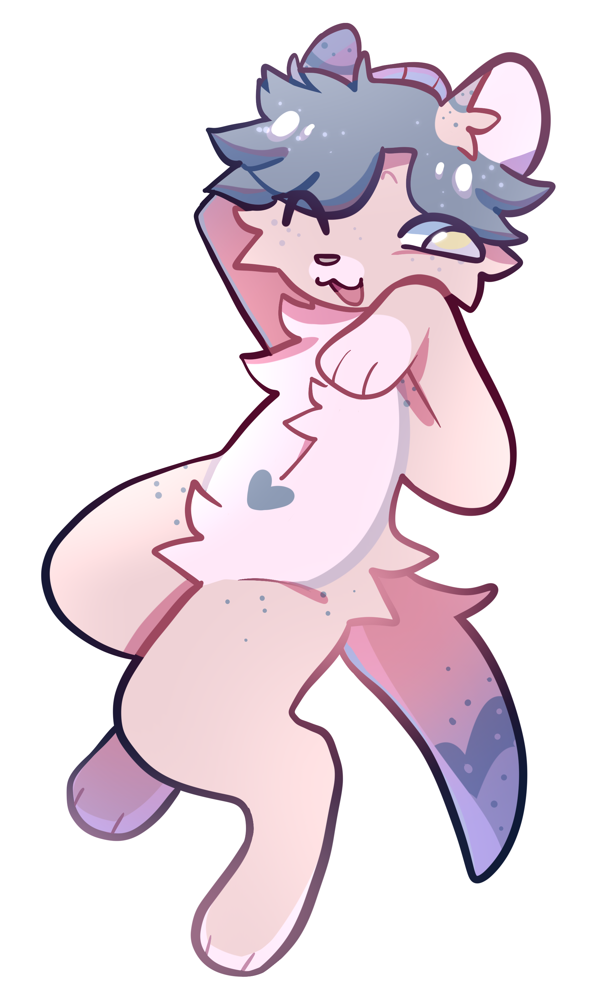

---

### Hey there! 👋

I like **writing code**, **Linux**, and **FOSS**.

I'm not an expert with any of these, but I try my best nevertheless.

##### MORE INFO

- 🎓 I am a first-year student at [CSUSM](https://www.csusm.edu) studying Computer Science
- ⚙️ I use Java, Bash, HTML5, and CSS3 most of the time
- 🦦 Obsessed with otters and other long noodle creatures
- 💬 Ask me about ricing and Arch Linux!
- ⚡ Fun fact: I began my programming journey in 2020 with an AP class!

---
